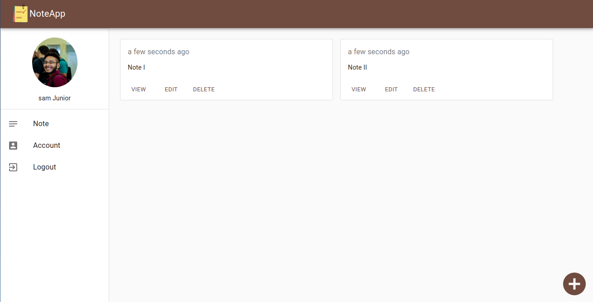
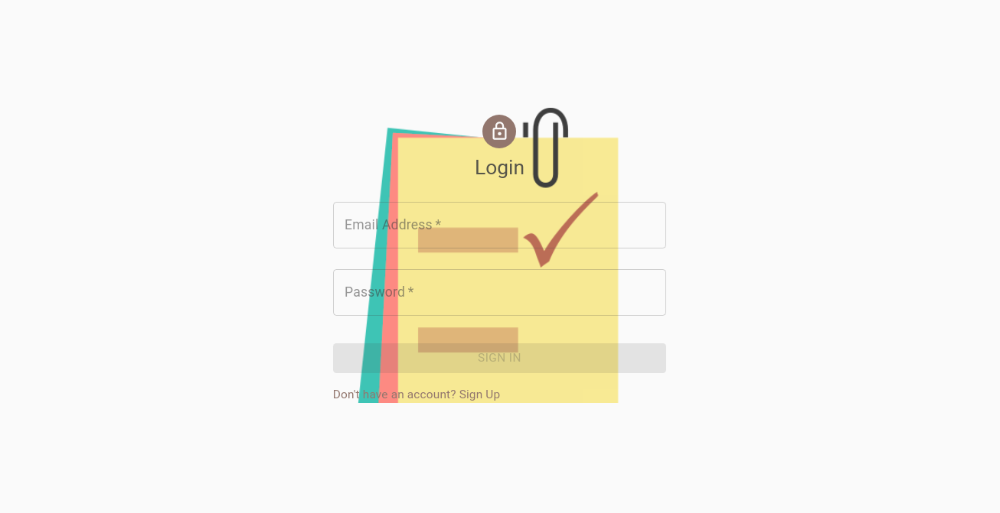
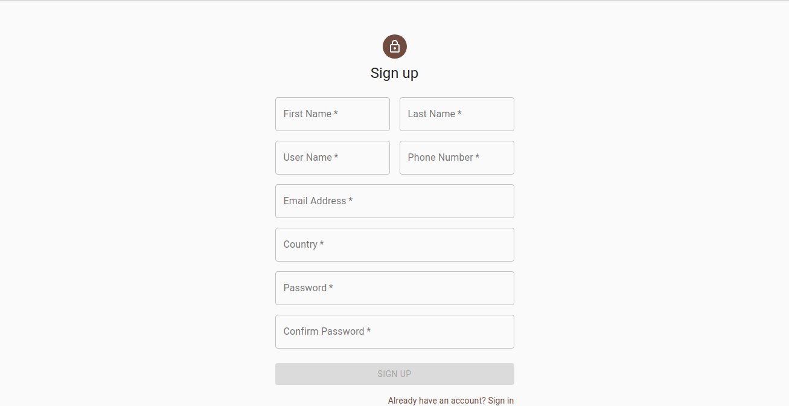
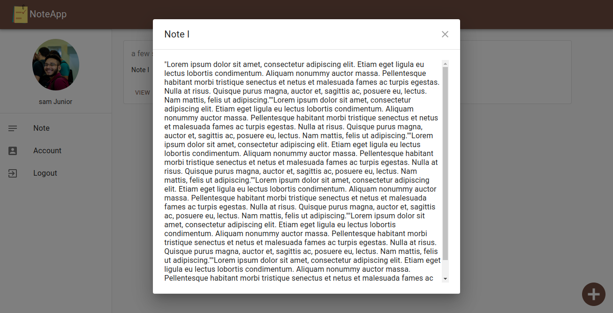
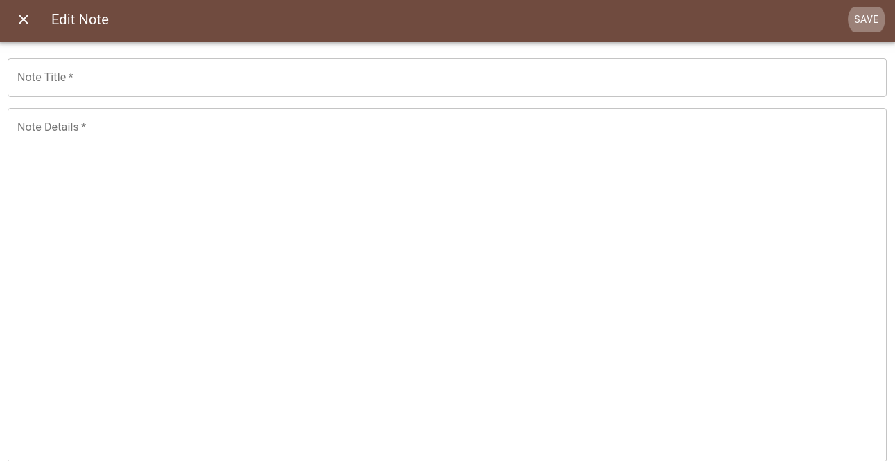
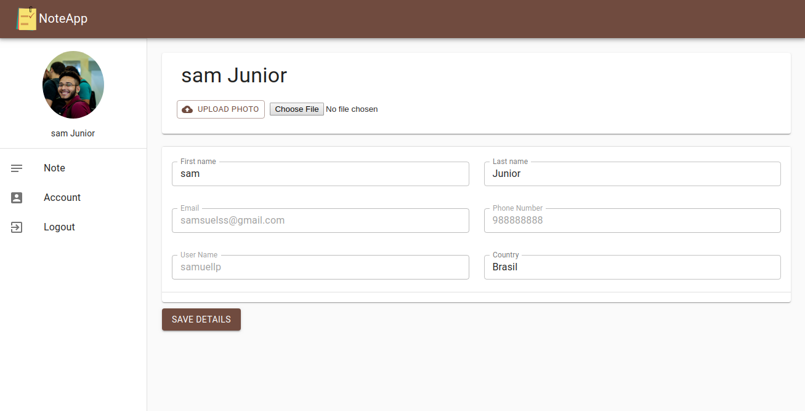

<h1 align="center">
  
</h1>

<br />

## 💻 Projeto


<strong>NotesApp<strong> é um projeto para ajudar as pessoas a se lembrarem de fazer todas as suas atividades. API construída com Firebase e express, e o front-end feito em ReactJS e MaterialUI.
<strong>Firebase Authentication<strong> é uma ferramenta proporcianada pelo firebase para autenticação de usuarios, age no aplicativo como um middleware de autenticação via tokenização, ao realizar login o usuario recebe um token encripitado em SHA-64 para autenticação da sua sessão, com isso ele pode ficar conectado no sistema. O tipo de token é o Bearer, que é enviado para o firebase para autenticação, caso esteja correto o usuário inicia uma sessão na aplicação.
<strong>Firebase Firestore<strong> é o database que guarda a estrutura de dados como um banco de dados da aplicação, guarda todas tabelas e estruturação da aplicação, porém os dados de cada usuário, como as notas são armazenadas por outro database especifico para os dados que é o <strong>Firebase Storage<strong> aqui é armazenado todos os dados da aplicação de modo ao usuário poder ter acesso a esses dados e não dados do sistema da aplicação em si. A parte do front-end é construída com material-UI que é uma ferramenta de construção de design rapido para React, foram utilizados alguns componentes do material-UI assim como a parte da estilização também foi realizada por ele.
<strong>Joi<strong> a parte da validação dos dados fica pelo Joi que é uma variação do Yup, logo todos os dados de entrada são verificados antes de repassado aos databases. Para o carregamento de imagem foi utilizado o <strong>Busboy<strong> que é uma ferramenta para o tratamento de tipos incomuns dentro do HTML, logo tratamos a imagem e fazemos o upload na base de dados do usuário. Abaixo temos as imagens de como é a aplicação e suas proporções.

<br />

## 🌐 Web

<h1 align="center">
	<h2>Login Page</h2>    
	
	<h2>SignUp Page</h2>	
	
	<h2>View Note Page</h2>	
	
	<h2>Edit Note Page</h2>	
	
	<h2>Account Page</h2>	
	
</h1>

<br />

## 🚀 Techs

This project was developed with the following technologies:

- [Firebase](https://firebase.google.com/?hl=pt-br)
	- Firestore: Database	
	- Authentication: User Authentication
	- Storage: Files Database
- [Express](https://expressjs.com/pt-br/)
- [React](https://reactjs.org)
- [Material UI](https://material-ui.com/)
- [Joi](https://github.com/hapijs/joi)
- [Insomnia](https://insomnia.rest/)

<br />

## 🔥 Install

```bash
# Clone this rep
$ git clone https://github.com/samueljrz/NotesApp

# After, enter the web folder and execute the comands:
$ npm
$ npm start
```
